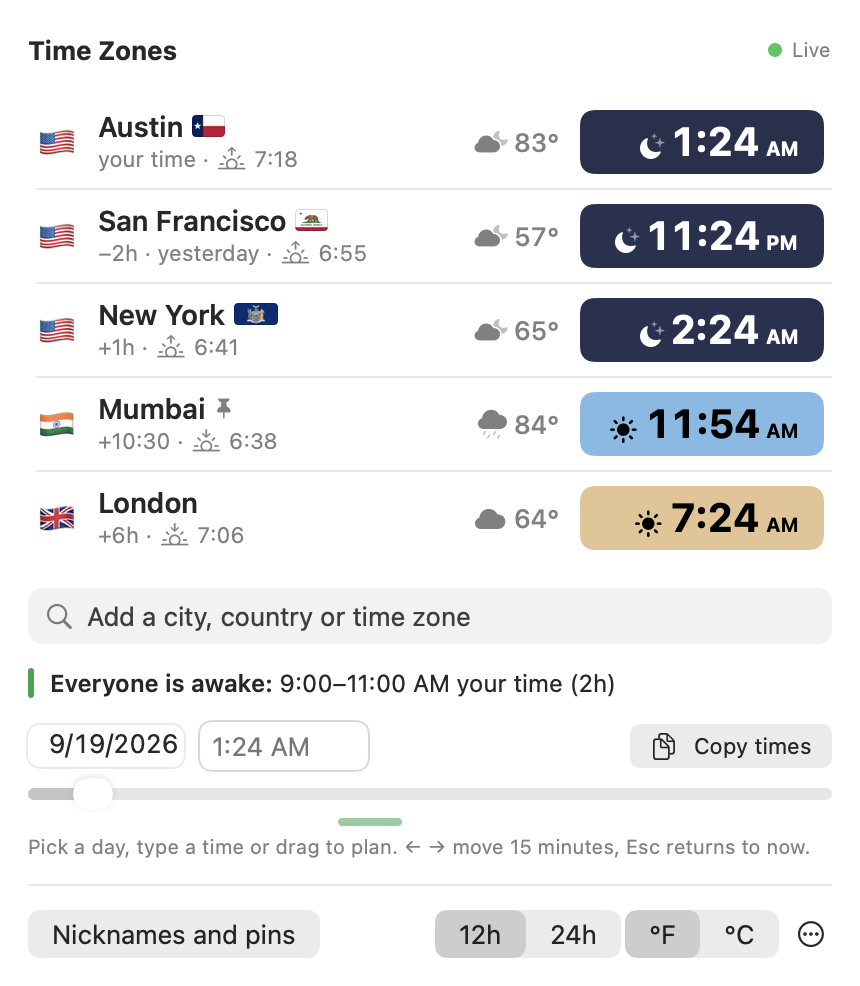
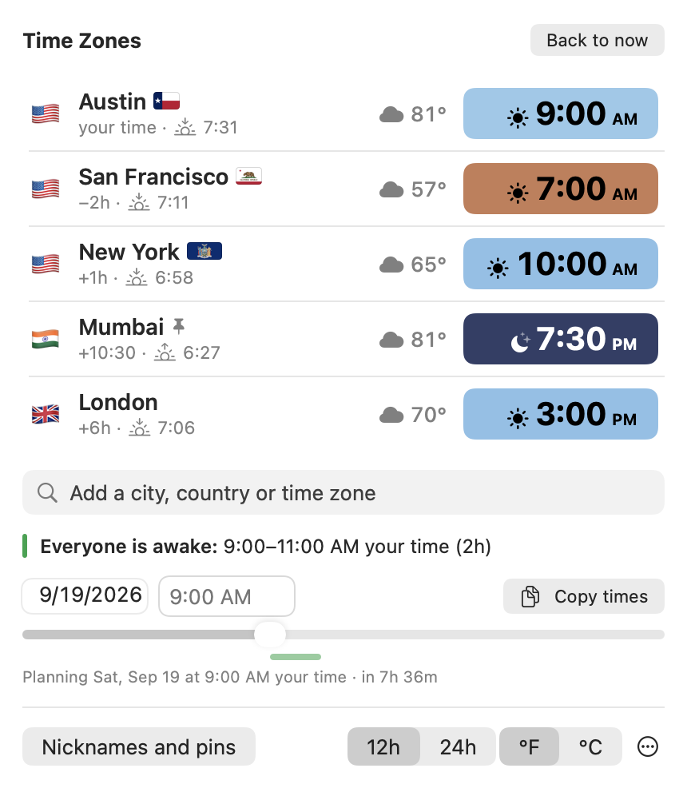
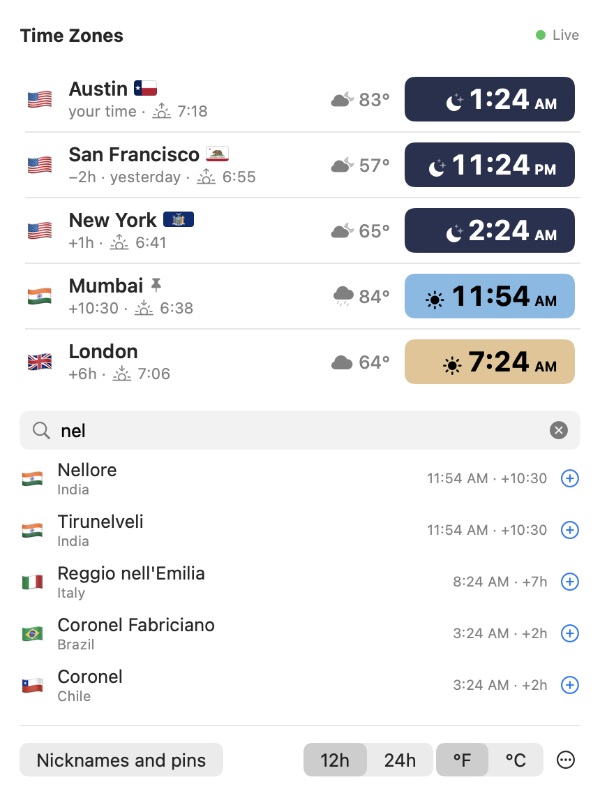
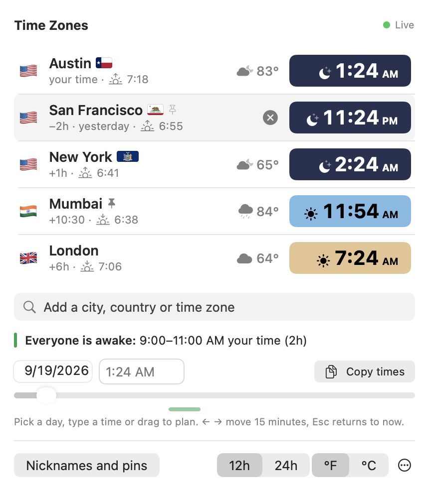
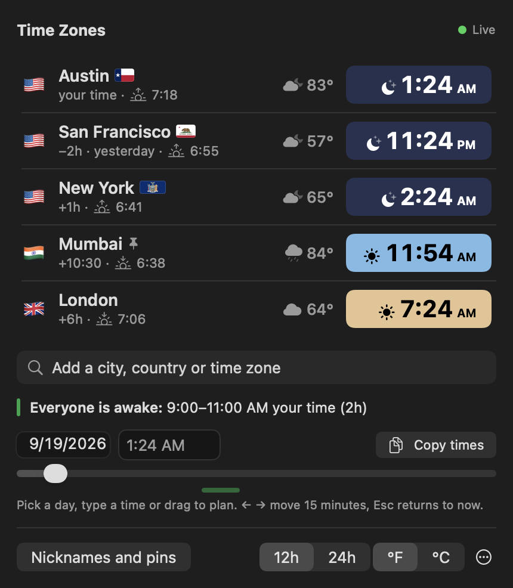

# Time Zones for Mac

Your family's and colleagues' times, right next to the Mac's clock. Click it for every city at a glance,
coloured by the real sky there, with the weather and the hours when everyone is awake.

A free companion to the [Time Zones](https://danpune.github.io/timezones/) website. No account, no ads, no tracking.

<p align="center"></p>

## Download

**[Download Time-Zones-mac.zip](https://github.com/danpune/timezones-mac/releases/latest/download/Time-Zones-mac.zip)**
(about 1 MB, macOS 13 or later, Apple silicon or Intel)

1. Double-click the zip, then drag **Time Zones** into your **Applications** folder and open it.
2. macOS says it can't check the app, because it isn't signed with a paid Apple developer account.
   Open **System Settings → Privacy & Security**, scroll down, click **Open Anyway** next to "Time Zones",
   and enter your password. You only do this once for each version
   ([Apple's guide](https://support.apple.com/guide/mac-help/open-a-mac-app-from-an-unknown-developer-mh40616/mac)).
3. Look at the top right of your screen: the app lives in the menu bar, next to the clock (there is no Dock icon).

## What you see

In the menu bar, up to three pinned cities with their flag and time, for example **🇮🇳 MUM 11:54 AM**.
Click it (or press **⌃⌥T** from any app) to open the panel. Each city shows:

- **The time**, on the colour of that city's sky right now: dark blue at night, orange at sunrise and sunset,
  light blue in the day, with a ☀️ / 🌅 / 🌙 symbol
- **How far it is from you** (+10:30, −2h) and **yesterday** or **tomorrow** when it's a different day there
- **The next sunrise or sunset**, and the **weather** with the temperature. Hover over a time for the day's
  sunrise, sunset and hours of daylight
- A **state flag** for cities in the US, Canada and Australia
- **Everyone is awake** (or **at work**): the hours that suit every city. Click it to plan that time

## How to use it

| | |
|---|---|
|  | **Plan a call.** Pick a day, type a time like **3pm**, or drag the slider. Every city shows its time then, and the green band under the slider marks when everyone is free. **Copy times** puts the list on your clipboard, ready to paste into WhatsApp or an email. **Back to now** (or Esc) returns to the live clock. |
|  | **Add a city.** Type a city, a country (**Thailand** gives Bangkok) or a time zone (**PST**, **IST**, **UTC+5:30**) and click **+** or press Return. |
|  | **Pin, reorder, remove.** Click a city to show it in the menu bar (up to three). Drag a city up or down to reorder. Hover and click **×** to remove it, or right-click for Move up, Move down and Remove. |
|  | **Make it yours.** 12h or 24h, °F or °C. **Nicknames and pins** lets you call a city "Mom" or "Office". The **⋯** menu has Open at login, the ⌃⌥T shortcut, Copy a link to the website, and Quit. |

A heads-up appears when a city changes its clocks for daylight saving in the next two weeks, so a call
isn't booked an hour off. Only the weather needs the internet (from [Open-Meteo](https://open-meteo.com/));
everything else is worked out on your Mac. City data: [GeoNames](https://www.geonames.org/), CC BY 4.0.

## Build it yourself

Needs only the Xcode Command Line Tools:

```
./build.sh            # builds build/Time Zones.app (universal, ad-hoc signed)
./build.sh install    # also copies it to /Applications and opens it
```

SwiftUI panel in an `NSStatusItem` + `NSPopover` (not `MenuBarExtra`, which can't be opened from code on
macOS 27). The sun maths and sky colours are the same as the website's. `Tests/Snap.swift` and
`Tests/Screens.swift` render the panel off-screen, so the UI can be checked and these screenshots updated
without screen access.

MIT licensed.
